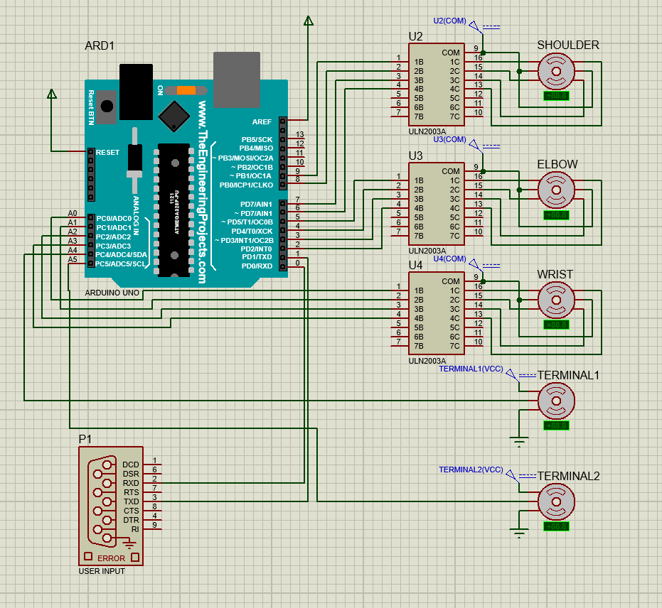
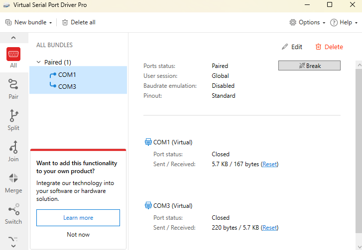

## Setup

Para poner en funcionamiento esta simulacion necesitas:

1. Proteus ~8.15v
2. El arhivo .ino de este repositorio adaptado para la simulacion [test.ino](https://github.com/Bushrdon/Robo-Arm-V1/blob/master/Firmware/src/test.ino)
3. Un virtualizador de puertos seriales como VSPD
4. El programa de python de este repositorio [main.py](https://github.com/Bushrdon/Robo-Arm-V1/blob/master/Software/main/src/main.py)

## Step by step guide:

### Arduino IDE

Abre el archivo **test.ino** y chequea que la opcion de compilacion este activa. 

Despues de eso compila el archivo dandole a **Verify**

Sigue esta guia en caso de perderte [Click](https://www-instructables-com.translate.goog/HOW-TO-GET-HEX-FILE-FROM-ARDUINO-/?_x_tr_sl=en&_x_tr_tl=es&_x_tr_hl=es&_x_tr_pto=tc)

Una vez compilado, en la terminal revisa la ruta que lleva a un archivo ".ino.hex" y copia esa ruta.

### Proteus

Abre el archivo de proteus, asegurate que el circuito hay cargado todas las librerias. Deberia lucir asi:

Selecciona el Arduino UNO y edita la ruta en la caja que dice **Program File**

Ahora pega la ruta del paso anterior teniendo en cuenta que en la ruta que copiaste cada slash en realidad se genero como un doble slash invertido, cambia cada uno de esos por un \ como se ve en el ejemplo resaltado.

### VSPD

Installa VSPD, puede seguir este tutorial [aqui](https://epiapoq-github-io.translate.goog/2021/04/02/compim/?_x_tr_sl=en&_x_tr_tl=es&_x_tr_hl=es&_x_tr_pto=tc)

Configuralo de modo que los puertos seriales queden de esta forma:

Antes de continuar asegurate de cerrar el Arduino IDE y/o cualquier programa que crees que tenga empleado el puerto serial COM1 y/o COM3.

### Python

Una vez que el VSPD haya conectado ambos puertos seriales abre la GUI siguiendo las indicaciones [aqui](https://github.com/Bushrdon/Robo-Arm-V1/tree/master/Software)
Tienes que tener todo correcto con respecto al programa en python para que funcione. 

## Probar

Con la simulacion abierta y el programa abierto, chequea que ambos puertos esten siendo usados en el VSPD, se deberia ver algo asi:

Empieza a correr la simulacion y prueba la GUI para observar el comportamiento de los motores. 
