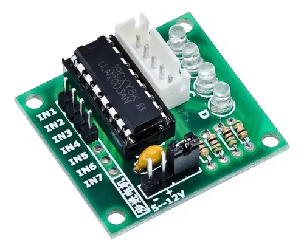
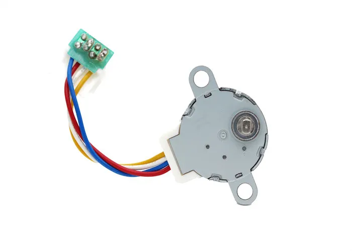

# Part List

Consider gather the exact following parts, otherwise you will encounter problems building the structure:

1. **ATmega328p (or any compatible board)**
2. **ULN2003A (x5)**
3. **Unipolar Stepper 24BYJ48-BJ (x5)**
4. **Servomotors MG90S Tower Pro (x2)**

# Power Supply

|Part|Quantity|Voltage (V)|Initial Current (mA)|Total Current (A)|Potency (W)|
|----|--------|-----------|-------------------|-----------------|-----------|
|24BYJ48-BJ|5|5v|160mA|800mA|9.6W|
|MG90S|2|5v|500mA|1000mA|5W|
|Arduino UNO|2|5v|50mA|50mA|0.25W|
|Total||5v||1850mA|14.85W|

# Parts Specs

Some comments:

## ULN2003A [(Datasheet)](https://www.alldatasheet.com/datasheet-pdf/view/25566/STMICROELECTRONICS/ULN2003A.html)

First of all, check the [schemes](https://github.com/Bushrdon/Robo-Arm-V1/blob/master/Hardware/schemes/Robotic-Arm.pdf)

Note that the "mirror" steppers use an inverted order driving signals, so just take the same output pins in the board and invert the order.
Otherwise steppers will perform opposite movement when installed in the robot structure. 

## Unipolar Stepper [(Datasheet)](https://d25vv4z8gtre3w.cloudfront.net/fajlcsatolas/24BYJ48_28BYJ48_30BYJ46%20l%C3%A9ptet%C5%91%20motor.pdf)

Consider that these stepper motors consume a reasonable amount of current when pressed enough by the structure load.
So, considering the joints 2 and 3 uses indeed 2 steppers, it is highly recommended to use more that 2 Amperes for this motors. This is probaly due to the fact that at start there's a small up-edge in current.
At the same time code does not manage fully well static steppers, so they will be consuming power even if they are not moving. 

## Servo Moros [(Datasheet)](https://www.bolanosdj.com.ar/MOVIL/ARDUINO2/MG90STowerPro.pdf)

As it is suggest in another part of this guide. You will need to use 360 degrees servos also called conitnuous rotation servo motors. If you happen to get 180 degrees it is actually better but you will need to re-write some code considering the difference between the two types. 
It would suggest using a external power supply since in the current design it uses Arduino UNO votlage regulator which is not neccesarily great.
