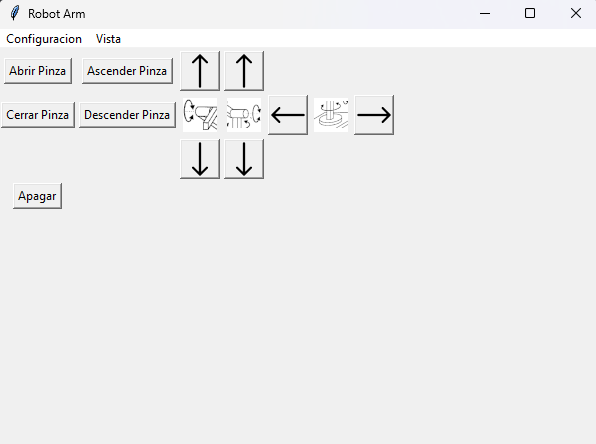

# Overview

 Robot Angular con 3 GDL controlado por medio de una interfaz grafica en Python/Tkinter y un microcontrolador ESP32 mediante motores paso a paso unipolares.
 
 

# Important Note

This is Robo-Arm-V1 which features high level embedded code and low potency 24BYJ48-BJ stepper motors and simple GUI interface. 

## Contents 

|Folder | Contents |
|-------|----------|
|[CAD](https://github.com/Bushrdon/Robo-Arm/tree/master/CAD)|Archivos CAD de modelos 3D|
|[Firmware](https://github.com/Bushrdon/Robo-Arm/tree/master/Firmware)|Archivo .ino con su documentacion|
|[Hardware](https://github.com/Bushrdon/Robo-Arm/tree/master/Hardware)|Esquemas electronicos y documentacion|
|[Software](https://github.com/Bushrdon/Robo-Arm/tree/master/Software)|Assests y codigo de la GUI y programacion serial|

 
## Features

 El proyecto integra control directo de los motores paso a paso mediante una GUI simple. 
 
 
 
## Project Structure

 * **Embedded** - Codigo embedido en C/C++ usando el framework de Arduino y su IDE

 * **Tkinter Code** - Codigo de alto nivel para la interfaz grafica y representacion visual del robot que implementa la libreria Pillow para el manejo de imagenes

 * **Pyserial Code** - Codigo que define la interfaz de comunicacion serial entre la PC y el microcontrolador implementando la libreria PySerial

 * **Schematics** - Documentacion referente a las conexiones y montaje general del hardware implementado
 
 * **CAD Models** - Referencia de modelos 3D usados para el robot.

## Prerequisites 

 * **Hardware**: 
   - Placa Espressif ESP32
   - Motores Paso a Paso Unipolares 24BYJ48-BJ
   - Modulo para ULN2003A
   - Cable USB mini USB-B (ESP32 USB Cable)
   
 * **Software**:
   - Arduino IDE
   - Python 3.13>=
   - ESP32 Arduino Core
   - Accelstepper Library
   
 * **Pip Packages**:
   - Pillow 
   - PySerial
	

## Installation/Setup

	[Bajo desarrollo]
	
