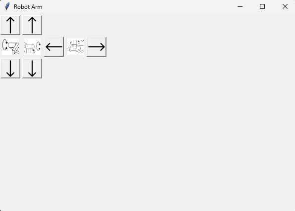

# Overview

 4 DOF Angular Robotic Arm with GUI Controlling Software using Python/Tkinter  

# Important Note

This is Robo-Arm-V1 which features high level embedded code and low potency 24BYJ48-BJ stepper motors, simple GUI interface. A Robotic-Arm-V2 will be developed soon. Or never.

## Contents 

|Folder | Contents |
|-------|----------|
|[CAD](https://github.com/Bushrdon/Robo-Arm/tree/master/CAD)|Notes on 3D Models and Robot Structure|
|[Firmware](https://github.com/Bushrdon/Robo-Arm/tree/master/Firmware)|Arduino Code|
|[Hardware](https://github.com/Bushrdon/Robo-Arm/tree/master/Hardware)|Electric Schematic, Documentation and Simulation made in Proteus 8.15|
|[Software](https://github.com/Bushrdon/Robo-Arm/tree/master/Software)|GUI Code and Assets|
 
## Features

This project features direct stepper and servomotors movement control using a simple GUI and Serial communication with a Host PC. 
 
 
 
## Project Structure

 * **Embedded** - Embedded code using Arduino Framework 

 * **Tkinter Code** - GUI Code written in Python

 * **Pyserial Code** - Serial Backend for microcontroller and Host PC communication

 * **Schematics** - Electrical wiring reference
    
 * **CAD Models** - 3D Models reference

## Prerequisites 

 * **Hardware**: 
   - Arduino UNO Dev Board (O compatible)
   - Unipolar Stepper Motors 24BYJ48-BJ
   - Driver Module ULN2003A
   - Servomotors MG90S
   - Arduino USB Cable (USB A to B)
        
 * **Software**:
   - Arduino IDE
   - Python 3.13
   - Accelstepper Library
   
 * **Pip Packages**:
   - Pillow 
   - PySerial
	
## How to Use

First, upload the Arduino code after following the schematics provided in Hardware/Schemes

Connect your board to the host PC and power the steppers with >24 Watts of potency. (Lesser or equal will be dangerous)

Open your terminal, search for Software/main/src/main.py and run it by entering:

	python main.py

In GUI, select the COM Port you are using. You will get error message in case of selecting a closed COM Port.

Use
	
	
